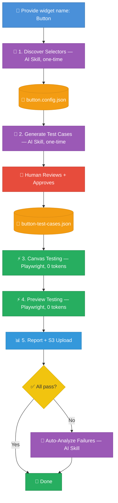
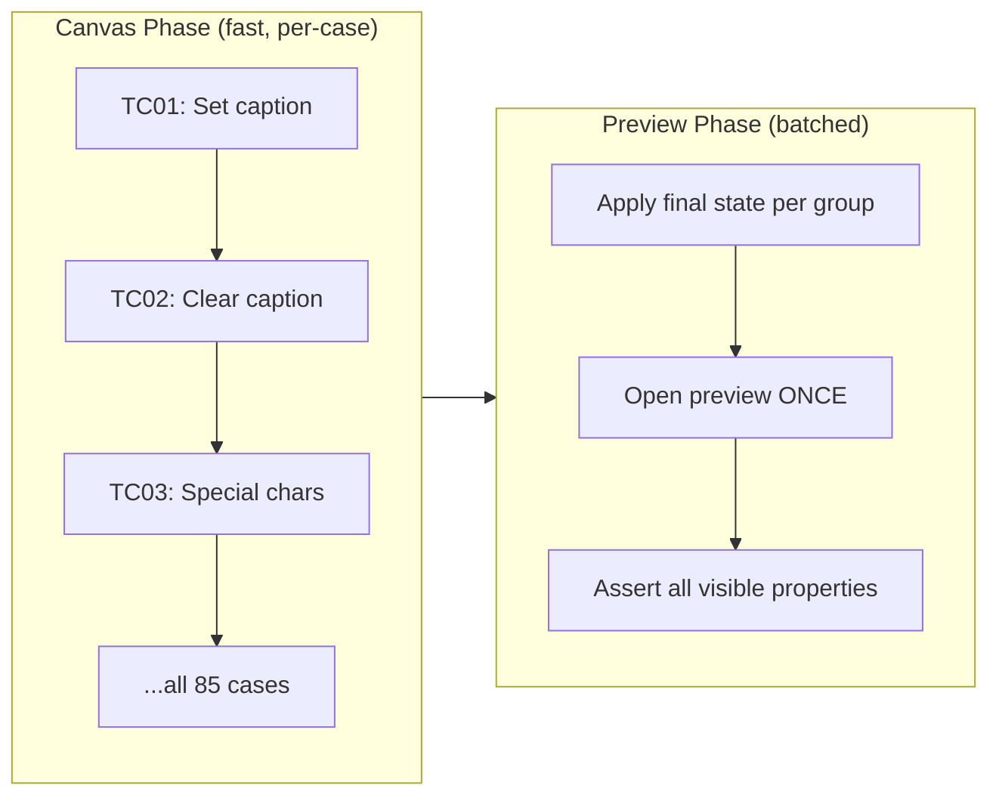

# **WaveMaker Studio Widget Property Test Framework**

## **Problem**

**The current approach uses an AI agent to interpret a 465-line SKILL.md and execute 85+ test cases interactively via browser MCP tools. For each test case, the agent must:**

- **Re-read the SKILL.md context (~5K tokens)**
- **Reason about selectors, waits, timing (~1-2K tokens per case)**
- **Execute 5-10 browser actions via tool calls (~500 tokens each)**
- **Open preview per case (build wait + assertion reasoning)**

**Estimated cost: ~150-250K tokens per widget run. For 50+ widgets, this is unsustainable.**

## **Solution Architecture**

**Fully automated with one human gate. You provide a widget name. Selector discovery, test case generation, canvas execution, preview execution, reporting, and failure analysis are all automated. The single human step is reviewing and approving the AI-generated test cases before they enter the deterministic pipeline.**

### Pipeline Overview

```
npx tsx scripts/run-widget-pipeline.ts Button
```



**Legend:**
- 🟣 Purple = AI Skill (tokens used once)
- 🟢 Green = Deterministic Playwright (0 tokens)
- 🔴 Red = Human gate (one manual step)
- 🟠 Orange = Data artifact (JSON files)
- 🔵 Blue = Input / Report

### Detailed Pipeline

```
Input: WIDGET_NAME=Button  →  npx tsx scripts/run-widget-pipeline.ts Button
```




```mermaid
flowchart TB
    trigger["npx run-widget-pipeline.ts Button"]

    subgraph phase1 ["PHASE 1: AI Skill — Discover Selectors (one-time, ~10K tokens)"]
        direction TB
        loginDisc["Login to Studio via Playwright"]
        addW["Add widget to canvas via drag-drop"]
        inspectPanel["Walk Properties/Styles/Events/Device tabs"]
        catalogPanel["Record each property: name, inputType, XPath"]
        inspectCanvas["Inspect canvas DOM: @name, @widgettype, sub-elements"]
        openPrev["Open preview, wait for build"]
        inspectPreview["Inspect preview DOM: @data-testid, @aria-label"]
        outputConfig["OUTPUT: button.config.json"]

        loginDisc --> addW --> inspectPanel --> catalogPanel
        catalogPanel --> inspectCanvas --> openPrev --> inspectPreview --> outputConfig
    end

    subgraph phase2 ["PHASE 2: AI Skill — Generate Test Cases (one-time, ~15K tokens)"]
        direction TB
        readConfig["Read button.config.json"]
        readSchema["Read test-case JSON schema from types.ts"]
        genPerProp["For each property in config: generate valid, edge, empty, binding cases"]
        addXPaths["Embed canvas + preview XPaths from config into each assertion"]
        assignMode["Assign previewMode: individual vs batched"]
        schemaVal["Auto-validate: JSON schema check"]
        humanReview["HUMAN REVIEW: inspect + approve/edit test cases"]
        approved["OUTPUT: button-test-cases.json (human-approved)"]

        readConfig --> readSchema --> genPerProp --> addXPaths --> assignMode --> schemaVal --> humanReview
        humanReview -->|"Approved"| approved
        humanReview -->|"Edit needed"| genPerProp
    end

    subgraph phase3 ["PHASE 3: Deterministic — Playwright Canvas Testing (0 tokens)"]
        direction TB
        globalSetup["Global Setup: auth, open app, add widget, select"]
        canvasLoop["FOR each test case: set property via panel XPath -> assert canvas via widget XPath"]
        canvasResult["Canvas results: pass/fail per case"]

        globalSetup --> canvasLoop --> canvasResult
    end

    subgraph phase4 ["PHASE 4: Deterministic — Playwright Preview Testing (0 tokens)"]
        direction TB
        prevOpen["Open preview via Ctrl+Alt+R"]
        buildWait["2-phase build wait: outer 8-step + inner rn-bundle 3-step"]
        batchAssert["Assert ALL cases in preview via @data-testid / @aria-label XPaths"]
        indivCases["Individual preview cases: Show=OFF, bindings, etc."]
        previewResult["Preview results: pass/fail per case"]

        prevOpen --> buildWait --> batchAssert --> previewResult
        buildWait --> indivCases --> previewResult
    end

    subgraph phase5 ["PHASE 5: Deterministic — Report + Auto-Analysis (0-5K tokens)"]
        direction TB
        mergeResults["Merge canvas + preview results"]
        genJSON2["Generate structured JSON report"]
        genHTML["Generate HTML report"]
        s3Up["Upload to S3: releases/ver/Widget-Property-Tests/canvas-preview/datetime/"]
        checkFail{"Any failures?"}
        analyzeAI["AI Skill: analyze-failures (auto-triggered)"]
        createIssues["Auto-create GitHub issues for failures"]
        done["Pipeline complete"]

        mergeResults --> genJSON2 --> genHTML --> s3Up --> checkFail
        checkFail -->|"Yes"| analyzeAI --> createIssues --> done
        checkFail -->|"No"| done
    end

    trigger --> phase1
    phase1 --> phase2
    phase2 --> phase3
    phase3 --> phase4
    phase4 --> phase5
```

### **Key Principle: Fully Automated with One Human Gate**

**Every step is automated except test case review -- the one point where a human inspects and approves the AI-generated test cases before they enter the deterministic pipeline. This is intentional: test case quality is the foundation; everything downstream depends on it.**


| **Step**               | **Old Approach**                            | **New Approach**                                                                   |
| ---------------------- | ------------------------------------------- | ---------------------------------------------------------------------------------- |
| **Selector discovery** | **Manual DOM inspection**                   | **AI Skill: auto-navigates Studio, catalogs all XPaths**                           |
| **Test case creation** | **AI agent writes each case interactively** | **AI Skill: generates full JSON in one pass, auto-validates**                      |
| **Test case review**   | **Human reads JSON, approves**              | **Human review (the ONE manual gate): inspect AI-generated JSON, approve or edit** |
| **Canvas testing**     | **AI agent executes per-case**              | **Deterministic: Playwright data-driven loop**                                     |
| **Preview testing**    | **AI agent opens preview 85x**              | **Deterministic: batched, opens preview 1-3x**                                     |
| **Report upload**      | **Manual S3 upload**                        | **Deterministic: auto-upload to S3**                                               |
| **Failure analysis**   | **Read logs manually**                      | **AI Skill: auto-triggered on failure, creates GitHub issues**                     |


### **Selector Architecture (3 DOM Contexts)**

```mermaid
flowchart LR
    subgraph ctxA ["Context A: Studio Properties Panel"]
        direction TB
        aDesc["SET property values"]
        aText["text: clear + type"]
        aToggle["toggle: click switch"]
        aDrop["dropdown: select option"]
        aBind["binding: open dialog + expression"]
    end

    subgraph ctxB ["Context B: Canvas DOM"]
        direction TB
        bDesc["ASSERT after property set"]
        bName["@name: //button name=button1"]
        bType["@widgettype: wm-button"]
        bClass["classes: .btn-caption, .wi-star"]
    end

    subgraph ctxC ["Context C: Preview RN Web Bundle"]
        direction TB
        cDesc["ASSERT in rn-bundle iframe"]
        cTestId["@data-testid: button1_caption"]
        cAria["@aria-label: label19_caption"]
        cPattern["Pattern: prefix + N + _ + subElement"]
    end

    ctxA -->|"Apply"| ctxB
    ctxB -->|"Preview build"| ctxC
```




**Context A: Studio Properties Panel (where we SET property values)**

- **The right-side panel in WaveMaker Studio**
- **Properties organized by tabs: Properties, Styles, Events, Device**
- **Each property field has a specific interaction type (text input, toggle, dropdown, binding dialog)**
- **Selectors target the property panel inputs, not the canvas**

**Context B: Canvas (where we ASSERT after setting a property)**

- **Uses XPath with WaveMaker-specific attributes:** `@name`**,** `@widgettype`**,** `@widget-id`**,** `@variant`
- **Existing patterns from [src/matrix/widget-xpaths.ts](src/matrix/widget-xpaths.ts):**
  - **Root:** `//button[@name='button1']`
  - **Sub-elements:** `//button[@name='button1']//span[@class='btn-caption']` **(caption text)**
  - **Icon:** `//button[@name='button1']//i` **(icon element)**

**Context C: Preview (RN Web Bundle iframe, where we ASSERT after preview build)**

- **Uses** `@data-testid` **and** `@aria-label` **accessibility attributes**
- **Existing patterns from [src/matrix/widget-xpaths.ts](src/matrix/widget-xpaths.ts):**
  - **Button:** `//div[@data-testid='button1_caption']/ancestor::div[@data-testid='non_animatableView'][1]`
  - **Label:** `//div[@aria-label='label19_caption']`
- **Naming convention:** `{widgetPrefix}{N}_{subElement}` **(e.g.,** `button1_caption`**,** `accordion1_header0`**)**
- **All preview assertions run inside the** `rn-bundle` **iframe, never on the Studio page**

### **Token Cost Comparison**


| **Activity**                | **Current (SKILL.md)**    | **New (Framework)**                       |
| --------------------------- | ------------------------- | ----------------------------------------- |
| **Selector discovery**      | **Manual**                | **~10K one-time (AI Skill)**              |
| **Test case generation**    | **~5K per invocation**    | **~15K one-time (AI Skill)**              |
| **Per test case execution** | **~2-3K tokens each**     | **0 tokens (deterministic)**              |
| **Preview per case**        | **~1-2K tokens per open** | **0 tokens (batched)**                    |
| **85 Button cases total**   | **~170-250K tokens**      | **0 tokens**                              |
| **Report + upload**         | **Manual**                | **0 tokens (deterministic)**              |
| **Failure analysis**        | **Manual log reading**    | **~5K auto-triggered (only on failures)** |
| **Total per run**           | **~170-250K**             | **~0-5K**                                 |
| **Total first-time setup**  | **~175-255K**             | **~25-30K**                               |
| **50 widgets first-time**   | **~8.5-12.5M**            | **~1.25-1.5M**                            |


## **Project Structure**

```
wm-widget-property-tests/
├── package.json                         # playwright, @aws-sdk/*, dotenv, typescript
├── tsconfig.json
├── playwright.config.ts                 # Chromium, storageState, XPath-aware
├── .env.example                         # Studio creds, AWS creds
│
├── widget-configs/                      # Per-widget: selectors + interaction map
│   └── button.config.json              #   propertiesPanel, canvasXPaths, previewXPaths
│
├── test-cases/                          # Per-widget: what to test (AI-generated, human-reviewed)
│   └── button-test-cases.json          #   inputType, canvasAssert, previewAssert, previewMode
│
├── src/
│   ├── types.ts                         # TestCase, WidgetConfig, AssertStrategy, TestResult
│   ├── helpers/
│   │   ├── studio-auth.ts               # Login (PlatformDB/Google/cookie)
│   │   ├── studio-app.ts                # Open app, save, navigate Studio
│   │   ├── widget-manager.ts            # Drag-drop (JS slow-mouse), select, re-select
│   │   ├── property-setter.ts           # Generic setter: text/toggle/dropdown/binding/combined
│   │   ├── canvas-asserter.ts           # XPath assertions in canvas (@name, @widgettype)
│   │   ├── preview-manager.ts           # Open preview, 2-phase build wait, iframe switch
│   │   ├── preview-asserter.ts          # XPath assertions in preview (@data-testid, @aria-label)
│   │   └── test-reporter.ts             # Structured JSON/HTML report + S3 upload
│   │
│   └── tests/
│       ├── global-setup.ts              # Auth + app open + widget placement (ONCE per suite)
│       └── widget-properties.spec.ts    # Data-driven Playwright runner (canvas + preview)
│
├── scripts/
│   └── run-widget-pipeline.ts           # CLI: orchestrates all 5 phases for a widget
│
└── skills/
    ├── discover-widget-selectors/
    │   └── SKILL.md                     # AI skill: auto-inspect Studio DOM, output widget-config.json
    ├── generate-test-cases/
    │   └── SKILL.md                     # Custom Claude skill: reads config + template, generates machine-executable test-cases JSON
    └── analyze-failures/
        └── SKILL.md                     # AI skill: categorize failures, create GitHub issues
```

## **Key Design Decisions**

### **1. AI Skill: Discover Widget Selectors (**`discover-widget-selectors/SKILL.md`**)**

**This skill replaces manual DOM inspection. It runs once per widget and outputs a complete** `widget-config.json`**.**

**What the skill does:**

1. **Launches Playwright, logs into Studio, opens the test app**
2. **Adds the target widget to canvas via drag-drop (JS slow-mouse approach)**
3. **Selects the widget, confirms right panel shows the widget**
4. **Walks all 4 tabs (Properties, Styles, Events, Device):**
  - **For each section/property, records the property name, input type (text/toggle/dropdown/binding), and the XPath to the input element**
  - **Expands collapsed sections, scrolls to reveal all properties**
5. **Inspects canvas DOM: finds the widget root element and all sub-elements, records XPaths using** `@name`**,** `@widgettype`**, CSS class patterns**
6. **Opens preview, waits for 2-phase build, inspects the rn-bundle iframe DOM for** `@data-testid` **and** `@aria-label` **values**
7. **Outputs** `widget-configs/{widget}.config.json`

**Output format:**

```json
{
  "widget": "Button",
  "tag": "wm-button",
  "prefix": "button",
  "componentPanelId": "#property-Button",
  "defaultName": "button1",
  "canvasXPaths": {
    "root": "//button[@name='button1']",
    "caption": "//button[@name='button1']//span[@class='btn-caption']",
    "icon": "//button[@name='button1']//i"
  },
  "previewXPaths": {
    "root": "//div[@data-testid='button1_caption']/ancestor::div[@data-testid='non_animatableView'][1]",
    "caption": "//div[@data-testid='button1_caption']",
    "accessibilityLabel": "//div[@aria-label='{value}']"
  },
  "propertiesPanel": {
    "Properties": {
      "Caption": { "xpath": "...", "interactionType": "text" },
      "Name": { "xpath": "...", "interactionType": "text" },
      "Accessibility > Accessible": { "xpath": "...", "interactionType": "toggle" },
      "Behavior > Show": { "xpath": "...", "interactionType": "toggle" },
      "Behavior > Animation": { "xpath": "...", "interactionType": "dropdown" },
      "Layout > Width": { "xpath": "...", "interactionType": "text" },
      "Graphics > Icon Class": { "xpath": "...", "interactionType": "text" },
      "Graphics > Icon Position": { "xpath": "...", "interactionType": "dropdown" }
    },
    "Styles": { ... },
    "Events": { ... },
    "Device": { ... }
  }
}
```

### **2. AI Skill: Generate Test Cases (**`generate-test-cases/SKILL.md`**)**

**A custom Claude skill (not BrowserStack subagent) that reads the widget config and generates machine-executable test case JSON. It knows WaveMaker-specific conventions, XPath patterns, and can use existing test case files as templates.**

**Why custom skill, not BrowserStack `test-case-generator`:**

- **BrowserStack subagent generates generic *what to test* but not *how to test* in our framework**
- **Our JSON needs precise XPaths for 3 DOM contexts, assertion strategies, inputTypes, previewMode**
- **Custom skill reads widget-config.json directly and embeds the correct selectors**
- **Knows WaveMaker-specific patterns: binding expressions, WM CSS variables, toggle behaviors**

**What the skill does:**

1. **Reads** `widget-configs/{widget}.config.json` **(output of Phase 1)**
2. **Reads** `src/types.ts` **for the TestCase JSON schema (ensures correct output format)**
3. **For each property in the config, generates multiple test cases from scratch: valid value, edge cases (empty, special chars, very long), bindings (**`{{variables.x}}`**)**
4. **Embeds** `canvasAssert` **and** `previewAssert` **with XPaths pulled directly from the config**
5. **Assigns** `previewMode: "individual"` **for visibility/layout/binding cases,** `"batched"` **for everything else**
6. **Auto-validates the output against the JSON schema**
7. **Outputs** `test-cases/{widget}-test-cases.json` **for human review**

**Output format per test case:**

```json
{
  "id": "TC01",
  "section": "Properties > Caption",
  "testCase": "Set a plain text caption",
  "input": "Submit",
  "inputType": "text",
  "canvasAssert": {
    "strategy": "text-content",
    "xpath": "//button[@name='button1']//span[@class='btn-caption']",
    "expected": "Submit"
  },
  "previewAssert": {
    "strategy": "text-content",
    "xpath": "//div[@data-testid='button1_caption']",
    "expected": "Submit"
  },
  "previewMode": "batched",
  "cleanup": null
}
```

**Assertion strategies:**

- `"text-content"` **-- check element text via XPath**
- `"visibility"` **-- check element exists/visible via XPath**
- `"attribute"` **-- check DOM attribute value (e.g.,** `aria-label`**,** `role`**,** `disabled`**)**
- `"css-property"` **-- locate via XPath, then** `getComputedStyle` **(width, height, background)**
- `"class-contains"` **-- check element has CSS class**
- `"not-exists"` **-- XPath should match 0 elements**

**Input types (how** `property-setter.ts` **interacts with Studio):**

- `"text"` **-- clear field, type value**
- `"toggle"` **-- click toggle switch**
- `"dropdown"` **-- open dropdown, select option**
- `"binding"` **-- open bind dialog, enter expression**
- `"combined"` **-- apply multiple properties in sequence (for combined test cases)**

### **3. Preview Batching (Major Optimization)**

**Instead of opening preview 85 times (one per test case), tests are split into two groups:**




- `**previewMode: "batched"` (default): Canvas assertion runs per-case. Preview assertion is deferred to a single batched preview session after all canvas tests complete.**
- `**previewMode: "individual"`: For cases that change visibility, toggle show/hide, or test bindings -- these open preview individually because they need a specific widget state.**

### **4. Data-Driven Test Spec (Core Logic)**

`widget-properties.spec.ts` **reads JSON + config and runs deterministically:**

```typescript
const widgetConfig = loadConfig(WIDGET_NAME);
const testCases = loadTestCases(WIDGET_NAME);

test.describe(`${WIDGET_NAME} Properties`, () => {
  test.beforeAll(async ({ browser }) => {
    // Login, open app, add widget, select it (ONCE)
  });

  for (const tc of testCases) {
    test(`${tc.id}: ${tc.testCase}`, async ({ page }) => {
      await propertySetter.apply(page, widgetConfig, tc);
      await canvasAsserter.verify(page, widgetConfig, tc);

      if (tc.previewMode === 'individual') {
        await previewManager.open(page);
        await previewAsserter.verify(page, widgetConfig, tc);
        await previewManager.returnToStudio(page);
      }
    });
  }

  test('Batched preview assertions', async ({ page }) => {
    const batchedCases = testCases.filter(tc => tc.previewMode !== 'individual');
    await previewManager.open(page);
    for (const tc of batchedCases) {
      await previewAsserter.verify(page, widgetConfig, tc);
    }
  });
});
```

### **5. AI Skill: Analyze Failures (**`analyze-failures/SKILL.md`**)**

**Auto-triggered when any test fails. Reads the structured JSON report and:**

1. **Categorizes failures: selector broken, timing issue, actual bug, environment flake**
2. **Clusters failures by property section (e.g., "all Layout tests failed" = panel XPath changed)**
3. **Suggests fixes (updated XPaths, increased timeouts, Studio bug report)**
4. **Auto-creates GitHub issues for confirmed failures**

### **6. Reusable Patterns from Existing Repo**

**Reference (follow the patterns, don't copy wholesale):**

- **Auth:** `StudioClient.loginWithPlatformDB()` **pattern from [tests/screens/studio.screen.ts](tests/screens/studio.screen.ts)**
- **Preview build-wait: 2-phase algorithm (outer 8-step + inner 3-step rn-bundle) from the SKILL.md**
- **Drag-drop: JS slow-mouse approach proven in the SKILL.md Step 10**
- **Environment config:** `.env` **pattern from [src/utils/env.ts](src/utils/env.ts)**
- **Canvas XPath conventions:** `@name`**,** `@widgettype`**, CSS classes from [src/matrix/widget-xpaths.ts](src/matrix/widget-xpaths.ts)**
- **Preview accessibility selectors:** `@data-testid` **/** `@aria-label` **with convention** `{prefix}{N}_{subElement}` **from [src/matrix/widget-xpaths.ts](src/matrix/widget-xpaths.ts)**
- **Computed CSS:** `getComputedCss()` **from [src/playwright/helpers.ts](src/playwright/helpers.ts) for style assertions**
- **S3 report upload: existing [scripts/upload-to-s3.ts](scripts/upload-to-s3.ts) and [scripts/s3-path-builder.ts**](scripts/s3-path-builder.ts)

### **7. Scaling to More Widgets**

**Once Button is validated, adding a new widget:**

1. **Run** `npx tsx scripts/run-widget-pipeline.ts {WidgetName}` **-- triggers full pipeline**
2. **Phase 1 (AI Skill) auto-discovers all selectors, outputs** `{widget}.config.json`
3. **Phase 2 (AI Skill) auto-generates** `{widget}-test-cases.json`
4. **Human reviews and approves the generated test cases (the ONE manual gate)**
5. **Phases 3-5 run deterministically: canvas, preview, report -- zero tokens**

